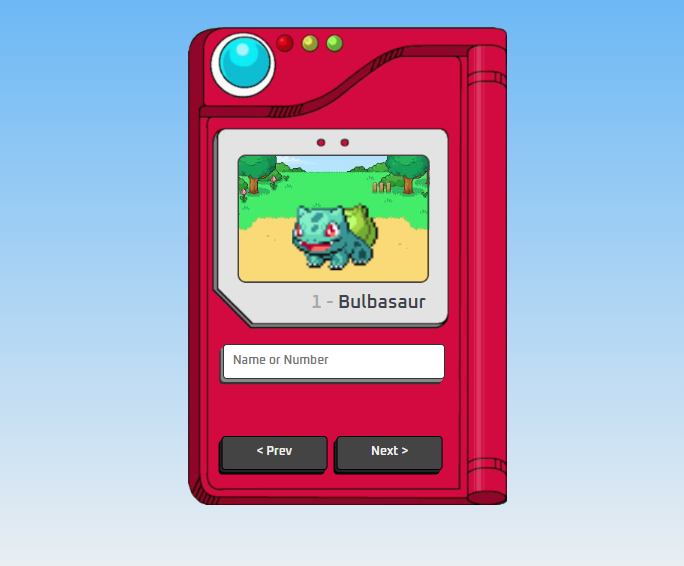

# Pokedex

##  [Demo](teste.com)

> Pokedex feito com HTML CSS e JavaScript

## 📝 Licença

Esse projeto está sob licença. Veja o arquivo [LICENSE.md](https://www.mit.edu/~amini/LICENSE.md) para mais detalhes.
